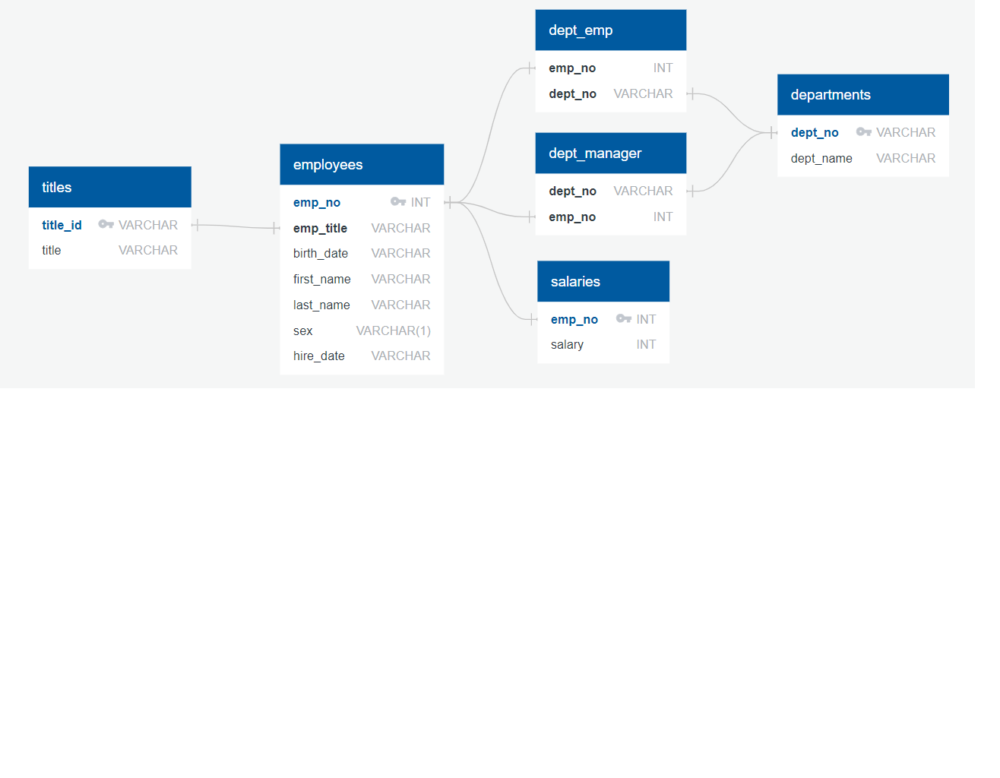

# sql-challenge
## Background
It’s been two weeks since you were hired as a new data engineer at Pewlett Hackard (a fictional company). Your first major task is to do a research project about people whom the company employed during the 1980s and 1990s. All that remains of the employee database from that period are six CSV files.

For this project, you’ll design the tables to hold the data from the CSV files, import the CSV files into a SQL database, and then answer questions about the data. That is, you’ll perform data modeling, data engineering, and data analysis, respectively.

## Objectives
This Challenge is divided into three parts:

    1. Data Modeling
    2. Data Engineering
    3. Data Analysis

## Data Modeling
After inspecting the CSVs, create an ERD using Quick Database Diagrams.



## Data Engineering
Create a table schema for each of the 6 CSV files with specific data types, primary keys, foreign keys, and constraints.

```pgsql
-- Data Engineering --
/*
-Use the provided information to create a table schema for each of the six CSV files. Be sure to do the following:
-Remember to specify the data types, primary keys, foreign keys, and other constraints.
-For the primary keys, verify that the column is unique. Otherwise, create a composite keyLinks to an external site., which takes two primary keys to uniquely identify a row.
-Be sure to create the tables in the correct order to handle the foreign keys.
-Import each CSV file into its corresponding SQL table
*/

/*Drop tables but drop dependent tables first
DROP TABLE dept_manager;
DROP TABLE salaries;
DROP TABLE dept_emp;
DROP TABLE departments;
DROP TABLE employees;
DROP TABLE titles;
*/

-- create titles table
CREATE TABLE titles (
	title_id VARCHAR PRIMARY KEY,
	title VARCHAR
);

-- create employees table
CREATE TABLE employees (
	emp_no INT PRIMARY KEY,
	emp_title_id VARCHAR,
	birth_date VARCHAR,
	first_name VARCHAR,
	last_name VARCHAR,
	sex VARCHAR,
	hire_date DATE,
	FOREIGN KEY (emp_title_id) REFERENCES titles(title_id)
	);

-- create departments table
CREATE TABLE departments (
	dept_no VARCHAR PRIMARY KEY,
	dept_name VARCHAR
);

-- create dept_manager table
CREATE TABLE dept_manager (
	dept_no VARCHAR,
	emp_no INT,
	PRIMARY KEY (dept_no, emp_no),
	FOREIGN KEY (dept_no) REFERENCES departments(dept_no),
	FOREIGN KEY (emp_no) REFERENCES employees(emp_no)
);

-- create dept_emp table
CREATE TABLE dept_emp (
	emp_no INT,
	dept_no VARCHAR,
	PRIMARY KEY (emp_no, dept_no),
	FOREIGN KEY (emp_no) REFERENCES employees(emp_no),
	FOREIGN KEY (dept_no) REFERENCES departments(dept_no)
);

-- create salaries table
CREATE TABLE salaries (
	emp_no INT PRIMARY KEY,
	salary INT,
	FOREIGN KEY (emp_no) REFERENCES employees(emp_no)
);

```

## Data Analysis
1. List the following details of each employee: employee number, last name, first name, sex, and salary.
```pgsql
SELECT e.emp_no, e.last_name, e.first_name, e.sex, s.salary
FROM employees AS e
JOIN salaries AS s ON (e.emp_no = s.emp_no);
```
2. List first name, last name, and hire date for employees who were hired in 1986.
```pgsql
SELECT first_name, last_name, hire_date
FROM employees
WHERE TO_CHAR(hire_date, 'YYYY') LIKE '1986%';
```
3. List the manager of each department with the following information: department number, department name, the manager's employee number, last name, first name.
```pgsql
SELECT dm.dept_no, d.dept_name, dm.emp_no, e.last_name, e.first_name
FROM employees as e
JOIN dept_manager as dm ON (e.emp_no = dm.emp_no)
JOIN departments as d ON (dm.dept_no = d.dept_no);
```
4. List the department of each employee with the following information: employee number, last name, first name, and department name.
```pgsql
SELECT dept_emp.dept_no, dept_emp.emp_no, e.last_name, e.first_name, departments.dept_name
FROM dept_emp
JOIN employees as e ON (dept_emp.emp_no = e.emp_no)
JOIN departments ON (dept_emp.dept_no = departments.dept_no);
```
5. List first name, last name, and sex for employees whose first name is "Hercules" and last names begin with "B."
```pgsql
SELECT first_name, last_name, sex
FROM employees
WHERE first_name = 'Hercules' AND last_name LIKE 'B%';
```
6. List all employees in the Sales department, including their employee number, last name, first name, and department name.
```pgsql
SELECT e.emp_no, e.last_name, e.first_name, departments.dept_name
FROM employees AS e
JOIN dept_emp ON (e.emp_no = dept_emp.emp_no)
JOIN departments ON (dept_emp.dept_no = departments.dept_no)
WHERE departments.dept_name = 'Sales';
```
7. List all employees in the Sales and Development departments, including their employee number, last name, first name, and department name.
```pgsql
SELECT e.emp_no, e.last_name, e.first_name, departments.dept_name
FROM employees AS e
JOIN dept_emp ON (e.emp_no = dept_emp.emp_no)
JOIN departments ON (dept_emp.dept_no = departments.dept_no)
WHERE departments.dept_name = 'Sales' OR departments.dept_name = 'Development';

/* SELECT e.emp_no, e.last_name, e.first_name, departments.dept_name
FROM departments
JOIN dept_emp ON (departments.dept_no = dept_emp.dept_no)
JOIN employees AS e ON (dept_emp.emp_no = e.emp_no)
WHERE departments.dept_name = 'Sales' OR departments.dept_name = 'Development'
GROUP BY e.emp_no, e.last_name, e.first_name, departments.dept_name
ORDER BY departments.dept_name; */
```
8. In descending order, list the frequency count of employee last names, i.e., how many employees share each last name.
```pgsql
SELECT last_name, COUNT(last_name) AS "Count of last name"
FROM employees
GROUP BY last_name
ORDER BY "Count of last name" desc;
```
